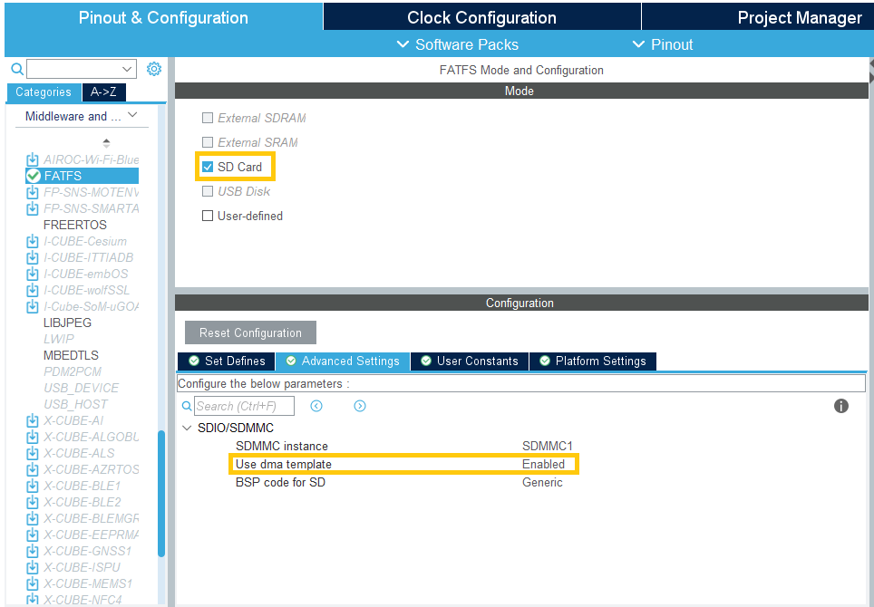
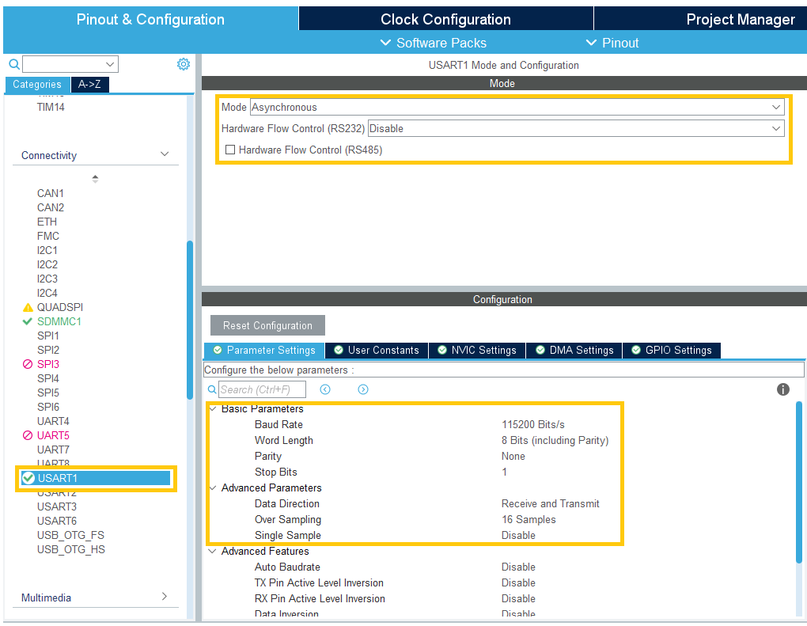
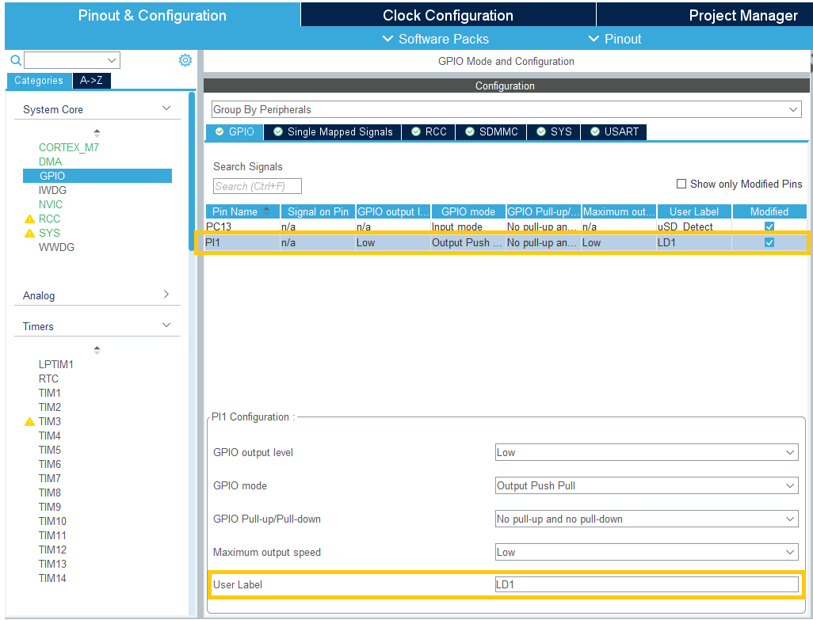

# STM32F746G Discovery Board + FatFs + uSD (CubeMX Example)

## Pre-requisites

- Hardware: STM32F746G-DISCO
- Software: STM32CubeIDE, STM32CubeMX

## Steps

1. Open STM32CubeMX

2. Create a new STM32 project

   - CubeMX -> New Project -> MCU/MPU Selector -> STM32F746NGH6

     

   - Apply the default configuration for MPU Configuration

     

3. SDMMC1 configuration

   - SDMMC is a peripheral that can be used to interface with an SD card.

   - Enable “SD mode” in “SDMMC1” in “Connectivity” and enable the global interrupt

     

   - Enable "SDMMC1_RX" and "SDMMC1_TX" in DMA Settings

     

4. FatFs configuration

   - FatFs is an open-source file system middleware integrated into STM32 Cube Libraries.

   - Configure FatFs as SD Card mode in “Middleware and Software Package”

     

   - Add DMA for TX and RX with default settings

     

   - Select PC13 as Detect_SDIO in Platform Settings

5. RCC and Clock tree configuration

   

   - Select Crystal/Ceramic Resonator for HSE and LSE Clock

   

   - Set Clock Configuration as shown above for each peripheral

6. USART1 for printf() debugging  
     

   - Set USART1 mode,  
     - Mode = Asynchronous (UART)  
     - RS232 = Disable  

   - Set USART1 parameters,  
     - Baud Rate = 115200 Bits/s  
     - Word Length = 8 Bits  
     - Parity = None  
     - Stop Bits = 1  


7. GPIO

   

   | Pin  | Signal on Pin | GPIO Output Level | GPIO Mode        | GPIO Pull-up/Pull-down      | Maximum Output Speed | User Label | Modified |
   |------|---------------|-------------------|------------------|-----------------------------|----------------------|------------|----------|
   | PC13 | n/a           | n/a               | Input mode       | No pull-up and no pull-down | n/a                  | uSD_Detect | TRUE     |
   | PI1  | n/a           | Low               | Output Push Pull | No pull-up and no pull-down | Low                  | LD1        | TRUE     |

8. Linker Settings

   - On the Project manager tab, select Linker Settings. Set parameters as below,
      - Minimum Heap Size = 0x400 (1024 Byte)
      - Minimum Stack Size = 0x800 (2048 Byte)
  
   

9. Add code in main.c

```c
/***************** Re-direct printf() to USART1 *****************/

/* USER CODE BEGIN Includes */

#include <stdio.h>

/* USER CODE END Includes */

/* Private macro -------------------------------------------------------------*/
/* USER CODE BEGIN PM */

#ifdef __GNUC__
#define PUTCHAR_PROTOTYPE int __io_putchar(int ch)
#else
#define PUTCHAR_PROTOTYPE int fputc(int ch, FILE* f)
#endif /* __GNUC__ */

/* USER CODE END PM */

/* USER CODE BEGIN 4 */

/**
 * @brief  Retargets the C library printf function to the USART.
 * @param  None
 * @retval None
 */
PUTCHAR_PROTOTYPE
{
  HAL_UART_Transmit(&huart1, (uint8_t*)&ch, 1, HAL_MAX_DELAY);
  return ch;
}

/* USER CODE END 4 */
```

```c
/***************** FatFS *****************/

/* Private variables ---------------------------------------------------------*/
/* USER CODE BEGIN PV */

uint8_t workBuffer[_MAX_SS];

/* USER CODE END PV */

/**
* @brief  The application entry point.
* @retval int
*/
int main(void)
{

  /* USER CODE BEGIN 1 */
  
  FRESULT res = FR_NOT_READY;                       /* FatFs function common result code */
  uint32_t bytesToWritten = 0;                      /* File write counts */
  uint32_t bytesToRead = 0;                         /* File read counts */
  uint8_t filePath[] = "STM32.TXT";                 /* File path buffer */
  uint8_t writeText[] = "STM32F746G FatFs + uSD";   /* File write buffer */
  uint8_t readText[100];                            /* File read buffer */

  /* USER CODE END 1 */

  /* USER CODE BEGIN 2 */

  /*##-1- Link the micro SD disk I/O driver ##################################*/
  if (FATFS_LinkDriver(&SD_Driver, SDPath) == 0)
  {
    /*##-2- Register the file system object to the FatFs module ##############*/
    if (f_mount(&SDFatFS, (TCHAR const*)SDPath, 0) != FR_OK)
    {
      /* FatFs Initialization Error */
      printf("FatFs: Failed to mount SD Card!!\n");
      Error_Handler();
    }
    else
    {
      printf("FatFs: Successfully mounted SD Card\n");

      /*##-3- Create a FAT file system (format) on the logical drive #########*/
      /* WARNING: Formatting the uSD card will delete all content on the device */
      printf("FatFs: Start formatting SD Card...\n");
      if (f_mkfs((TCHAR const*)SDPath, FM_ANY, 0, workBuffer, sizeof(workBuffer)) != FR_OK)
      {
        /* FatFs Format Error */
        printf("FatFs: Failed to format SD Card!!\n");
        Error_Handler();
      }
      else
      {
        /*##-4- Create and Open a new text file object with write access #####*/
        printf("FatFs: Successfully to format SD Card!!\n");
        if (f_open(&SDFile, (const TCHAR*)filePath, FA_CREATE_ALWAYS | FA_WRITE) != FR_OK)
        {
          /* 'STM32.TXT' file Open for write Error */
          printf("FatFs: Failed to open file for writing!!\n");
          Error_Handler();
        }
        else
        {
          printf("FatFs: Successfully to opened file!!\n");

          /*##-5- Write data to the text file ################################*/
          res = f_write(&SDFile, writeText, sizeof(writeText), (void*)&bytesToWritten);
          printf("FatFs: Write '%s' -> %s\n", writeText, filePath);

          if ((bytesToWritten == 0) || (res != FR_OK))
          {
            /* 'STM32.TXT' file Write or EOF Error */
            printf("FatFs: Failed to write data to file!!\n");
            Error_Handler();
          }
          else
          {
            printf("FatFs: Data successfully written to file!!\n");

            /*##-6- Close the open text file #################################*/
            f_close(&SDFile);

            /*##-7- Open the text file object with read access ###############*/
            if (f_open(&SDFile, (const TCHAR*)filePath, FA_READ) != FR_OK)
            {
              /* 'STM32.TXT' file Open for read Error */
              printf("FatFs: Failed to open file for reading!!\n");
              Error_Handler();
            }
            else
            {
              /*##-8- Read data from the text file ###########################*/
              res = f_read(&SDFile, readText, sizeof(readText), (UINT*)&bytesToRead);

              if ((bytesToRead == 0) || (res != FR_OK))
              {
                /* 'STM32.TXT' file Read or EOF Error */
                printf("FatFs: Failed to read data from file!!\n");
                Error_Handler();
              }
              else
              {
                printf("FatFs: Data successfully read from file!!\n");

                printf("FatFs: Read from file %s -> '%s'\n", filePath, readText);
                /*##-9- Close the open text file #############################*/
                f_close(&SDFile);

                /*##-10- Compare read data with the expected data ############*/
                if ((bytesToRead != bytesToWritten))
                {
                  /* Read data is different from the expected data */
                  printf("FatFs: Read data differs from the expected data!!\n");
                  Error_Handler();
                }
                else
                {
                  /* Success of the demo: no error occurrence */
                  HAL_GPIO_WritePin(LD1_GPIO_Port, LD1_Pin, GPIO_PIN_SET);
                  printf("FatFs: Demo executed successfully!!\n");
                }
              }
            }
          }
        }
      }
    }
  }

  /*##-11- Unlink the micro SD disk I/O driver ###############################*/
  FATFS_UnLinkDriver(SDPath);

  /* USER CODE END 2 */

  /* Infinite loop */
  /* USER CODE BEGIN WHILE */
  while (1)
  {
    /* USER CODE END WHILE */

    /* USER CODE BEGIN 3 */
  }
  /* USER CODE END 3 */
}
```

```c
/***************** Error Diagnostic LED LD1  *****************/

/* USER CODE END 4 */
/**
  * @brief  This function is executed in case of error occurrence.
  * @retval None
  */
void Error_Handler(void)
{
  /* USER CODE BEGIN Error_Handler_Debug */
  /* User can add his own implementation to report the HAL error return state */
  HAL_GPIO_WritePin(LD1_GPIO_Port, LD1_Pin, GPIO_PIN_SET);
  while (1)
  {
    HAL_GPIO_TogglePin(LD1_GPIO_Port, LD1_Pin);
    HAL_Delay(100);
  }
  /* USER CODE END Error_Handler_Debug */
}
```

CubeMX wrong initial value on MX_SDMMC1_SD_Init()

```c
void MX_SDMMC1_SD_Init(void)
{

  /* USER CODE BEGIN SDMMC1_Init 0 */

  /* USER CODE END SDMMC1_Init 0 */

  /* USER CODE BEGIN SDMMC1_Init 1 */

  /* USER CODE END SDMMC1_Init 1 */
  hsd1.Instance = SDMMC1;
  hsd1.Init.ClockEdge = SDMMC_CLOCK_EDGE_RISING;
  hsd1.Init.ClockBypass = SDMMC_CLOCK_BYPASS_DISABLE;
  hsd1.Init.ClockPowerSave = SDMMC_CLOCK_POWER_SAVE_DISABLE;
  
  // REMARK: Start with 1B instead 4B. Later "SD_Widebus_Enable" command makes it 4B
  hsd1.Init.BusWide = SDMMC_BUS_WIDE_1B;

  hsd1.Init.HardwareFlowControl = SDMMC_HARDWARE_FLOW_CONTROL_DISABLE;
  hsd1.Init.ClockDiv = 0;
  /* USER CODE BEGIN SDMMC1_Init 2 */

  /* USER CODE END SDMMC1_Init 2 */

}
```

---

## Reference
[STM32CubeF7/Projects/STM32746G-Discovery/Applications/FatFs/FatFs_uSD](https://github.com/STMicroelectronics/STM32CubeF7/tree/master/Projects/STM32746G-Discovery/Applications/FatFs/FatFs_uSD)  
[How to create a File System on a SD card using STM32CubeIDE](https://community.st.com/t5/stm32-mcus/how-to-create-a-file-system-on-a-sd-card-using-stm32cubeide/ta-p/49830)  
[RM0385 Reference manual](https://www.st.com/resource/en/reference_manual/rm0385-stm32f75xxx-and-stm32f74xxx-advanced-armbased-32bit-mcus-stmicroelectronics.pdf)  
[UM1721 User manual Developing applications on STM32Cube™ with FatFs](https://www.st.com/resource/en/user_manual/um1721-developing-applications-on-stm32cube-with-fatfs-stmicroelectronics.pdf)  
[STM32 – Creating a File System on a SD card](https://www.youtube.com/watch?v=I9KDN1o6924&ab_channel=STMicroelectronics)  
